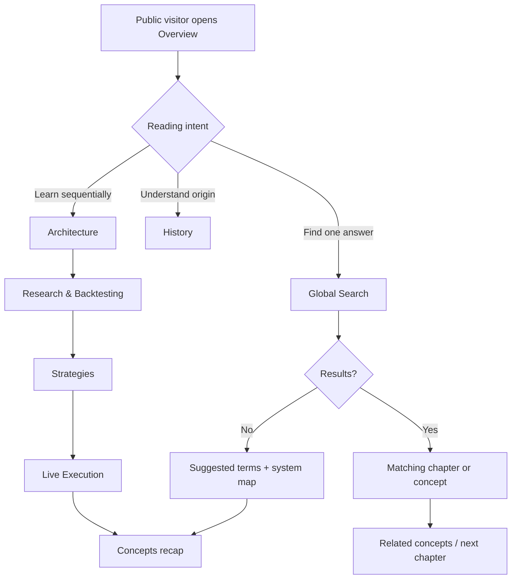

# Public Portal Navigation Flow

All endpoints retain primary navigation, search, theme selection, a route back
to Overview, and a visible explanation-only boundary. Missing optional visual
evidence falls back to complete text; missing required factual evidence is
labelled unavailable rather than invented.
